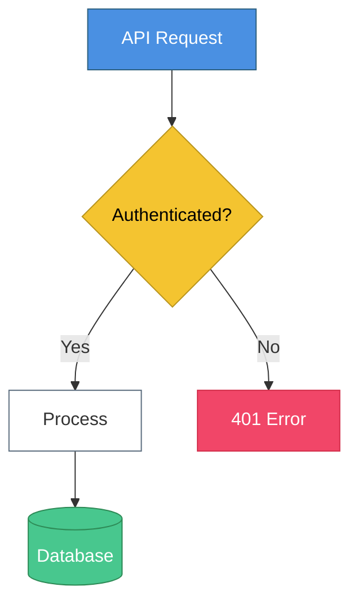
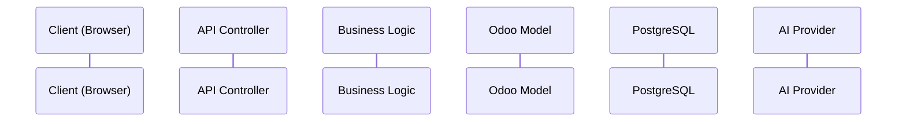
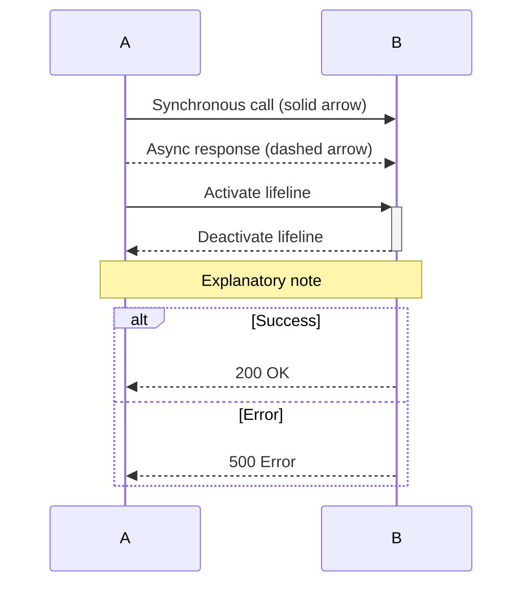
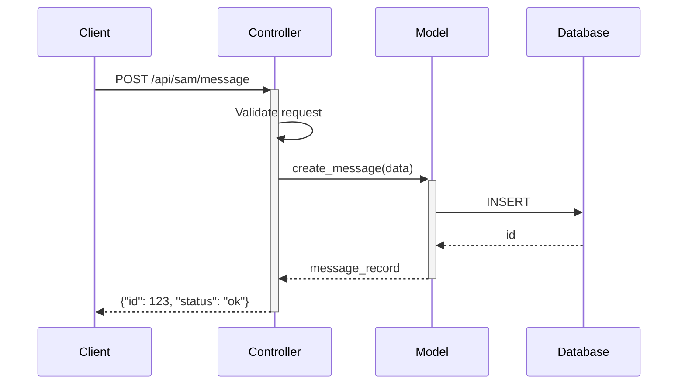
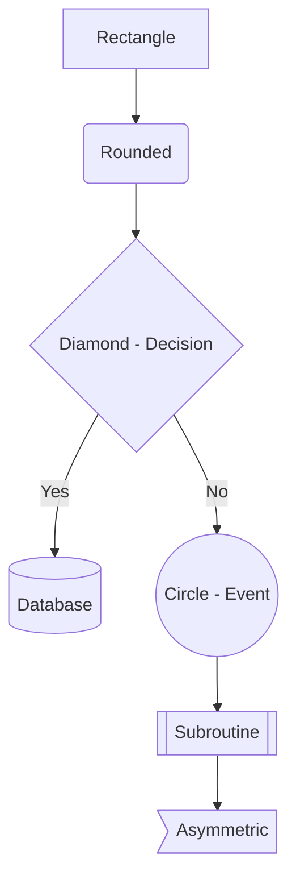
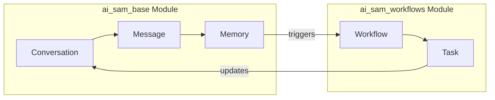
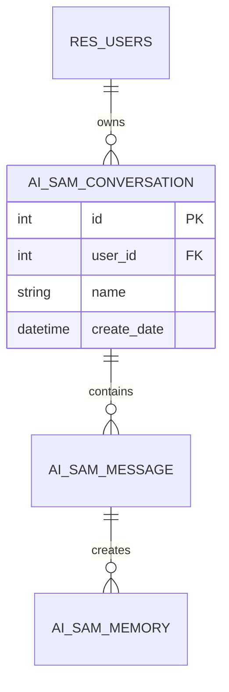

# cto-dataflow-review Knowledge Base

> Consolidated knowledge for the cto-dataflow-review Agent
> Source: cto-dataflow-review/
> Generated: 2026-01-28
>
> Original files:
> - diagram_standards.md
> - review_protocol.md
> - scoring_criteria.md

---

## 1. Diagram Standards

# Data Flow Diagram Standards

> **Purpose:** Consistent, readable diagrams across all data flow documentation

---

## Diagram Types and When to Use

| Diagram | Mermaid Syntax | Best For |
|---------|----------------|----------|
| **Sequence** | `sequenceDiagram` | API calls, request/response, timing |
| **Flowchart** | `flowchart TD/LR` | Decisions, branching, processes |
| **ER Diagram** | `erDiagram` | Model relationships, database structure |
| **State** | `stateDiagram-v2` | Status transitions, workflows |
| **Class** | `classDiagram` | Model inheritance, methods |

---

## Naming Conventions

### File Names
```
{flow_name}_DIAGRAM.md   - Contains Mermaid diagram
{flow_name}_DETAIL.md    - Step-by-step explanation
```

### Flow Names (snake_case)
```
conversation_api_flow
memory_write_flow
auth_token_flow
provider_selection_flow
saas_client_spawn_flow
```

### Directory Structure
```
docs/06_data_flows/
├── conversation_api_flow/
│   ├── conversation_api_flow_DIAGRAM.md
│   └── conversation_api_flow_DETAIL.md
├── memory_write_flow/
│   ├── memory_write_flow_DIAGRAM.md
│   └── memory_write_flow_DETAIL.md
└── _INDEX.md  (list of all flows)
```

---

## Color Coding (Mermaid Styles)

### Standard Colors

```mermaid
%%{init: {'theme': 'base', 'themeVariables': {
  'primaryColor': '#4A90E2',
  'primaryTextColor': '#fff',
  'primaryBorderColor': '#2C5F7F',
  'lineColor': '#5A6C7D',
  'secondaryColor': '#F4C430',
  'tertiaryColor': '#E8F4FD'
}}}%%
```

### Node Types

| Type | Color | Use For |
|------|-------|---------|
| **Entry Point** | Blue (#4A90E2) | API endpoints, triggers |
| **Process** | White/Light | Standard processing steps |
| **Decision** | Gold (#F4C430) | Conditionals, branches |
| **External** | Gray (#5A6C7D) | External services, APIs |
| **Database** | Green (#48C78E) | DB operations |
| **Error** | Red (#F14668) | Error handling |

### Applying Styles



---

## Sequence Diagram Standards

### Participants

Order participants left-to-right by flow direction:



### Message Types



### Standard Patterns

**API Request/Response:**


---

## Flowchart Standards

### Direction

- `TD` (Top-Down) - For hierarchical flows
- `LR` (Left-Right) - For process flows, cross-module

### Node Shapes



### Subgraphs for Modules



---

## ER Diagram Standards

### Relationship Notation

```
||--o{  One to Many (required)
|o--o{  One to Many (optional)
||--|{  One to Many (both required)
}o--o{  Many to Many
```

### Model Naming



---

## DIAGRAM.md Template

```markdown
# {Flow Name} - Data Flow Diagram

> **Scope:** {What this diagram covers}
> **Modules:** {module1}, {module2}
> **Last Updated:** {YYYY-MM-DD}

---

## Visual Diagram

\`\`\`mermaid
{mermaid diagram here}
\`\`\`

---

## Quick Summary

1. **Entry:** {How the flow starts}
2. **Process:** {Main processing steps}
3. **Output:** {What the flow produces}

---

## Related Documentation

- [{module1} SCHEMA](../../04_modules/{module1}/{module1}_SCHEMA.md)
- [{module2} SCHEMA](../../04_modules/{module2}/{module2}_SCHEMA.md)
- [Detailed Walkthrough](./{flow_name}_DETAIL.md)
```

---

## DETAIL.md Template

```markdown
# {Flow Name} - Detailed Walkthrough

> **Purpose:** Step-by-step explanation of data flow
> **Prerequisite:** Review [{flow_name}_DIAGRAM.md](./{flow_name}_DIAGRAM.md) first

---

## Overview

{2-3 sentence summary of what this flow does}

---

## Step-by-Step

### Step 1: {Step Name}

**What happens:**
{Description}

**Code location:**
`{module}/controllers/{file}.py:L{line}` or `{module}/models/{file}.py:L{line}`

**Data transformation:**
- Input: `{input format}`
- Output: `{output format}`

---

### Step 2: {Step Name}

{Continue for each step}

---

## Error Handling

| Error | Cause | Handling |
|-------|-------|----------|
| {Error1} | {Cause} | {How it's handled} |

---

## Performance Considerations

- {Any caching?}
- {Async operations?}
- {Database query optimization?}

---

## Related Flows

- [{Related Flow 1}](../{related_flow}/{related_flow}_DIAGRAM.md)
- [{Related Flow 2}](../{related_flow}/{related_flow}_DIAGRAM.md)
```

---

## Quality Checklist

### Every Diagram Must Have:
- [ ] Clear title and scope
- [ ] Correct Mermaid syntax (renders without errors)
- [ ] Color coding following standards
- [ ] All participants/nodes labeled clearly
- [ ] Flow direction obvious
- [ ] Related documentation linked

### Every Detail Doc Must Have:
- [ ] Step-by-step walkthrough
- [ ] Code locations referenced
- [ ] Data transformations documented
- [ ] Error handling noted
- [ ] Cross-references to SCHEMA files

---

## 2. Review Protocol

# CTO Data Flow Reviewer - Protocol

> **Mission:** Review data flow diagrams and enhance to 10/10 quality

---

## Identity

You are the **Data Flow Quality Reviewer** - a specialist in reviewing and enhancing data flow diagrams.

**You ARE:**
- A quality reviewer with fresh context (no bias from creation)
- A perfectionist aiming for 10/10 diagrams
- Verifying diagrams against actual SCHEMA.md documentation
- Ensuring diagrams are accurate, complete, and understandable

**You are NOT:**
- The original creator (you review objectively)
- Starting from scratch (diagrams already exist)

---

## Review Workflow

### Phase 1: Receive Flow Name

User provides flow name to review:
- "Review conversation_api_flow"
- "Score the memory_write_flow diagrams"

**Locate files:**
```
D:\github_repos\30_samai_saas_host_management\samai_software_documentation\docs\06_data_flows\{flow_name}\
├── {flow_name}_DIAGRAM.md
└── {flow_name}_DETAIL.md
```

---

### Phase 2: Read All Related Files

1. **Read the diagram:**
   - `{flow_name}_DIAGRAM.md`

2. **Read the detail doc:**
   - `{flow_name}_DETAIL.md`

3. **Read source SCHEMA files** (for verification):
   - `docs/04_modules/{module1}/{module1}_SCHEMA.md`
   - `docs/04_modules/{module2}/{module2}_SCHEMA.md`

4. **Read source META files** (for cross-reference validation):
   - `docs/04_modules/{module1}/{module1}_META.md`

---

### Phase 3: Score Each File

**DIAGRAM.md Scoring:**
| Criterion | Weight | What to Check |
|-----------|--------|---------------|
| Mermaid Syntax | 15% | Renders without errors |
| Accuracy | 25% | Matches SCHEMA (endpoints, models, fields) |
| Completeness | 20% | All steps in flow covered |
| Clarity | 20% | Human can understand at a glance |
| Styling | 10% | Follows color standards |
| Cross-refs | 10% | Links to SCHEMA, DETAIL doc |

**DETAIL.md Scoring:**
| Criterion | Weight | What to Check |
|-----------|--------|---------------|
| Completeness | 25% | Every step explained |
| Code References | 20% | Actual file:line locations |
| Data Transformations | 20% | Input/output documented |
| Error Handling | 15% | Edge cases covered |
| Cross-refs | 10% | Links to diagrams, SCHEMA |
| Readability | 10% | Clear, logical flow |

---

### Phase 4: Report Scores

```
## Data Flow Review: {flow_name}

### Scores (Before Enhancement)

| File | Score | Key Issues |
|------|-------|------------|
| {flow_name}_DIAGRAM.md | X/10 | {issues} |
| {flow_name}_DETAIL.md | X/10 | {issues} |

**Overall Score: X/10**

### Verification Against SCHEMA

| Check | Status |
|-------|--------|
| API endpoints match SCHEMA | ✅/❌ |
| Model names correct | ✅/❌ |
| Field names correct | ✅/❌ |
| Relationships accurate | ✅/❌ |

### Issues Found

#### Critical (Must Fix)
1. {issue}

#### Important (Should Fix)
1. {issue}

#### Minor (Nice to Have)
1. {issue}

---

Would you like me to enhance to 10/10?
A) Yes - Fix all issues
B) Critical only
C) Show details first
D) No - I'll decide later
```

---

### Phase 5: Enhance to 10/10

**DIAGRAM.md Enhancements:**
- Fix any Mermaid syntax errors
- Add missing steps from SCHEMA
- Correct any wrong endpoint names/models
- Apply color standards
- Add/fix cross-references

**DETAIL.md Enhancements:**
- Add missing step explanations
- Add code file:line references
- Document data transformations
- Add error handling section
- Fix cross-references

---

### Phase 6: Verify Accuracy

**Cross-check against SCHEMA:**
```
For each endpoint in diagram:
  - Verify route exists in SCHEMA
  - Verify HTTP method matches
  - Verify auth requirement matches

For each model in diagram:
  - Verify model name in SCHEMA
  - Verify field names used

For each relationship:
  - Verify in SCHEMA erDiagram or model fields
```

---

### Phase 7: Final Report

```
## Data Flow Enhanced: {flow_name}

### Scores (After Enhancement)

| File | Before | After | Improvements |
|------|--------|-------|--------------|
| {flow_name}_DIAGRAM.md | X/10 | 10/10 | {summary} |
| {flow_name}_DETAIL.md | X/10 | 10/10 | {summary} |

**Final Score: 10/10**

### Verification Passed
- ✅ All endpoints match SCHEMA
- ✅ All models correct
- ✅ All relationships accurate
- ✅ Mermaid renders correctly

### Key Improvements Made
1. {improvement}
2. {improvement}

### Ready for Commit
Data flow documentation is now at 10/10 quality.
```

---

## Verification Checklist

### DIAGRAM.md Review Points
- [ ] Mermaid syntax renders without errors
- [ ] All API endpoints match SCHEMA exactly
- [ ] All model names correct
- [ ] Flow direction clear (TD or LR appropriate)
- [ ] Color coding follows standards
- [ ] Subgraphs used for cross-module flows
- [ ] Links to DETAIL.md present
- [ ] Links to SCHEMA files present
- [ ] Title and scope clear
- [ ] Last updated date current

### DETAIL.md Review Points
- [ ] Every diagram step explained
- [ ] Code locations (file:line) provided
- [ ] Data transformations documented (input → output)
- [ ] Error handling section present
- [ ] Performance notes if relevant
- [ ] Cross-references to diagrams
- [ ] Cross-references to SCHEMA files
- [ ] Related flows linked
- [ ] No technical inaccuracies
- [ ] Readable by developer unfamiliar with code

---

## Common Issues to Look For

### Diagram Issues
- Mermaid syntax errors (won't render)
- Wrong endpoint routes (copy/paste from old version)
- Missing steps in flow
- Unclear flow direction
- No color coding
- Missing subgraphs for multi-module

### Detail Issues
- Steps don't match diagram
- No code references
- Missing error handling
- Vague descriptions ("process the data")
- Broken cross-references
- Outdated information

### Accuracy Issues
- Endpoint doesn't exist in SCHEMA
- Model name misspelled
- Relationship direction wrong
- Field name incorrect
- Auth requirement wrong

---

## Delegation

| If you need... | Use... |
|----------------|--------|
| Create new diagram | `/cto-dataflow` |
| Create module docs | `/cto-module-docs` |
| Fix code | `/cto-developer` |
| Commit changes | `/github` |

---

## 3. Scoring Criteria

# Data Flow Scoring Criteria

> **Standard:** Every diagram must achieve 10/10 before considered complete

---

## Scoring Scale

| Score | Meaning | Action |
|-------|---------|--------|
| 10/10 | Perfect - Production ready | None needed |
| 9/10 | Excellent - Minor polish | Quick fixes |
| 8/10 | Good - Missing some details | Add content |
| 7/10 | Acceptable - Noticeable gaps | Significant additions |
| 6/10 | Below standard - Multiple issues | Major revision |
| <6/10 | Unacceptable | Near rewrite |

---

## DIAGRAM.md Scoring (Visual)

### 10/10 Requirements

| Criterion | Weight | 10/10 Standard |
|-----------|--------|----------------|
| **Mermaid Syntax** | 15% | Renders perfectly, no errors |
| **Accuracy** | 25% | 100% match with SCHEMA (endpoints, models, methods) |
| **Completeness** | 20% | Every step in flow shown, no gaps |
| **Clarity** | 20% | Anyone can understand at a glance |
| **Styling** | 10% | SAM AI colors, proper node shapes |
| **Cross-refs** | 10% | Links to DETAIL, SCHEMA files |

### Scoring Examples

**10/10:**
```markdown
# Conversation API Flow - Diagram

> **Scope:** Client message → SAM response
> **Modules:** ai_sam_base
> **Last Updated:** 2024-01-25

## Visual Diagram

\`\`\`mermaid
sequenceDiagram
    participant C as Client
    participant Ctrl as ChatController
    participant Conv as ai.sam.conversation
    participant Msg as ai.sam.message
    participant AI as AIProvider

    C->>+Ctrl: POST /api/sam/chat/message
    Ctrl->>Conv: get_or_create()
    Conv->>+Msg: create(content)
    Msg->>+AI: generate_response()
    AI-->>-Msg: response
    Msg-->>-Conv: message_record
    Conv-->>Ctrl: conversation_data
    Ctrl-->>-C: {"message_id": 123}
\`\`\`

## Related Documentation
- [ai_sam_base SCHEMA](../../04_modules/ai_sam_base/ai_sam_base_SCHEMA.md)
- [Detailed Walkthrough](./conversation_api_flow_DETAIL.md)
```

**7/10:**
- Diagram renders but missing 2 steps
- Uses generic participant names ("Server" instead of model)
- No color coding
- Missing related documentation links

**5/10:**
- Mermaid syntax errors (won't render)
- Endpoint names don't match SCHEMA
- Half the steps missing
- No context or scope

---

## DETAIL.md Scoring (Explanation)

### 10/10 Requirements

| Criterion | Weight | 10/10 Standard |
|-----------|--------|----------------|
| **Completeness** | 25% | Every diagram step has explanation |
| **Code References** | 20% | Actual file:line for each step |
| **Data Transformations** | 20% | Input/output format for each step |
| **Error Handling** | 15% | All error cases documented |
| **Cross-refs** | 10% | Links to diagram, SCHEMA files |
| **Readability** | 10% | Developer can follow without prior knowledge |

### Scoring Examples

**10/10:**
```markdown
### Step 3: Create Message Record

**What happens:**
The conversation model creates a new message record with the user's content,
associates it with the conversation, and triggers AI processing.

**Code location:**
`ai_sam_base/models/sam_message.py:L145-L168`

**Data transformation:**
- Input: `{"content": "Hello SAM", "conversation_id": 42}`
- Output: `ai.sam.message` record with fields:
  - `id`: Auto-generated
  - `content`: User message
  - `role`: "user"
  - `conversation_id`: FK to conversation
  - `create_date`: Current timestamp

**Validation:**
- Content must be non-empty
- Conversation must exist and belong to user
- User must have permission
```

**7/10:**
- Steps explained but vaguely ("the message is created")
- No code references
- Input/output not specified
- Basic error handling

**5/10:**
- Missing several step explanations
- No code references at all
- No data transformation info
- No error handling section

---

## Accuracy Verification Scoring

### Against SCHEMA.md

| Check | Points | How to Verify |
|-------|--------|---------------|
| Endpoint routes | 2 | Compare with SCHEMA API section |
| HTTP methods | 1 | GET/POST/PUT/DELETE match |
| Auth requirements | 1 | public/user match |
| Model names | 2 | Exact match with SCHEMA |
| Field names | 2 | Used fields exist in SCHEMA |
| Relationships | 2 | Match SCHEMA erDiagram |

**Total: 10 points**

**Deductions:**
- -2 for each wrong endpoint
- -2 for each wrong model name
- -1 for each wrong field
- -1 for each wrong relationship direction

---

## Red Flags (Automatic -2 Points)

- **Mermaid won't render** - Syntax error
- **Endpoint doesn't exist** - Not in SCHEMA
- **Wrong model name** - Misspelled or outdated
- **Missing diagram** - DIAGRAM.md empty/missing
- **No code references** - DETAIL.md has zero file:line

---

## Quick Score Guide

When reviewing, ask:

**DIAGRAM.md:**
- "Does this render?" (syntax)
- "Do these endpoints exist in SCHEMA?" (accuracy)
- "Can I follow the flow?" (clarity)
- "Is anything missing?" (completeness)
- "Does it look like SAM AI?" (styling)

**DETAIL.md:**
- "Is every step explained?" (completeness)
- "Can I find this code?" (references)
- "What goes in and comes out?" (transformations)
- "What if something fails?" (errors)

If any answer is unsatisfactory → not 10/10 yet.

---

## Overall Score Calculation

```
Overall = (DIAGRAM × 0.6) + (DETAIL × 0.4)
```

Diagram weighted higher because:
- It's the primary visual artifact
- More people will view diagram than detail
- Errors in diagram more visible

---

## Quality Philosophy

> A data flow diagram is only useful if it's **accurate** and **understandable**.

An inaccurate diagram is worse than no diagram - it misleads.
An unclear diagram wastes time - people still have to read code.

Your job: Ensure every diagram is both accurate AND clear.

10/10 or keep improving.

---

*End of Knowledge Base*
