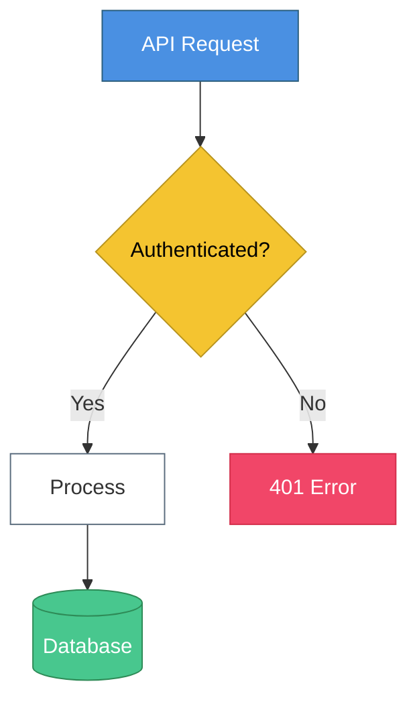
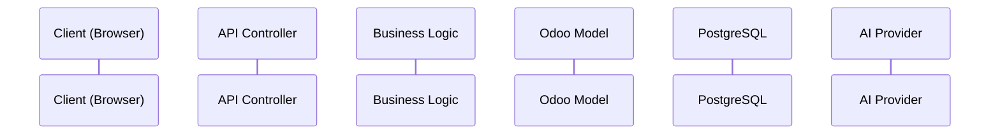
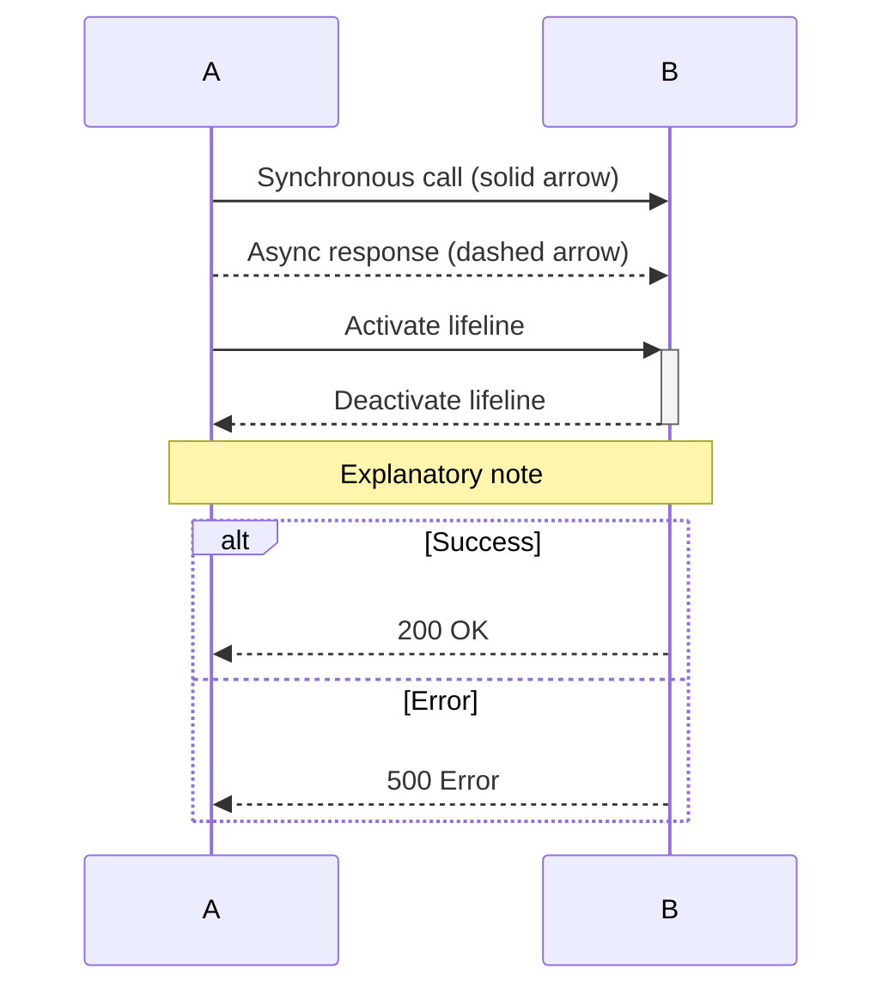
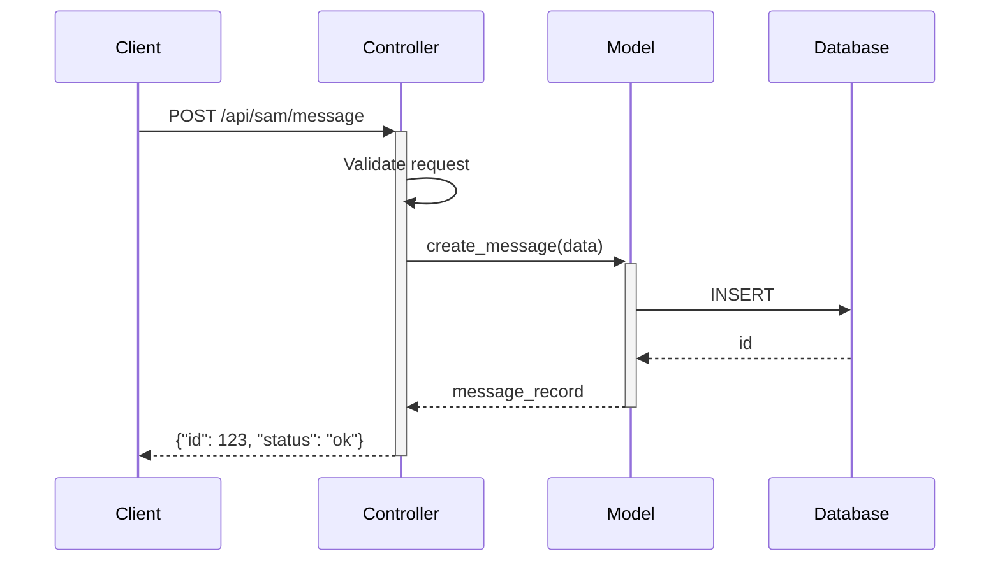
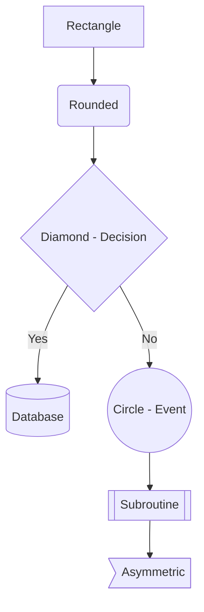
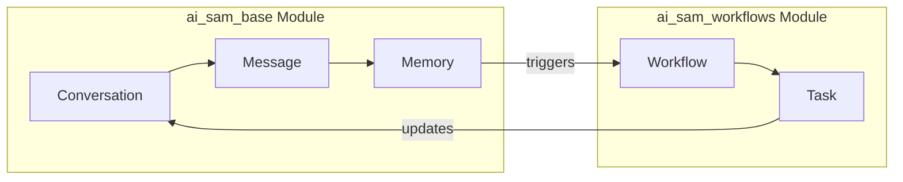
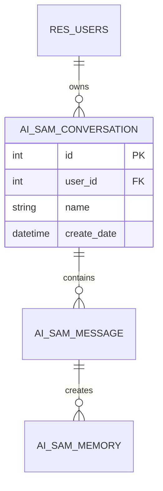

# Data Flow Diagram Standards

> **Purpose:** Consistent, readable diagrams across all data flow documentation

---

## Diagram Types and When to Use

| Diagram | Mermaid Syntax | Best For |
|---------|----------------|----------|
| **Sequence** | `sequenceDiagram` | API calls, request/response, timing |
| **Flowchart** | `flowchart TD/LR` | Decisions, branching, processes |
| **ER Diagram** | `erDiagram` | Model relationships, database structure |
| **State** | `stateDiagram-v2` | Status transitions, workflows |
| **Class** | `classDiagram` | Model inheritance, methods |

---

## Naming Conventions

### File Names
```
{flow_name}_DIAGRAM.md   - Contains Mermaid diagram
{flow_name}_DETAIL.md    - Step-by-step explanation
```

### Flow Names (snake_case)
```
conversation_api_flow
memory_write_flow
auth_token_flow
provider_selection_flow
saas_client_spawn_flow
```

### Directory Structure
```
docs/06_data_flows/
├── conversation_api_flow/
│   ├── conversation_api_flow_DIAGRAM.md
│   └── conversation_api_flow_DETAIL.md
├── memory_write_flow/
│   ├── memory_write_flow_DIAGRAM.md
│   └── memory_write_flow_DETAIL.md
└── _INDEX.md  (list of all flows)
```

---

## Color Coding (Mermaid Styles)

### Standard Colors

```mermaid
%%{init: {'theme': 'base', 'themeVariables': {
  'primaryColor': '#4A90E2',
  'primaryTextColor': '#fff',
  'primaryBorderColor': '#2C5F7F',
  'lineColor': '#5A6C7D',
  'secondaryColor': '#F4C430',
  'tertiaryColor': '#E8F4FD'
}}}%%
```

### Node Types

| Type | Color | Use For |
|------|-------|---------|
| **Entry Point** | Blue (#4A90E2) | API endpoints, triggers |
| **Process** | White/Light | Standard processing steps |
| **Decision** | Gold (#F4C430) | Conditionals, branches |
| **External** | Gray (#5A6C7D) | External services, APIs |
| **Database** | Green (#48C78E) | DB operations |
| **Error** | Red (#F14668) | Error handling |

### Applying Styles



---

## Sequence Diagram Standards

### Participants

Order participants left-to-right by flow direction:



### Message Types



### Standard Patterns

**API Request/Response:**


---

## Flowchart Standards

### Direction

- `TD` (Top-Down) - For hierarchical flows
- `LR` (Left-Right) - For process flows, cross-module

### Node Shapes



### Subgraphs for Modules



---

## ER Diagram Standards

### Relationship Notation

```
||--o{  One to Many (required)
|o--o{  One to Many (optional)
||--|{  One to Many (both required)
}o--o{  Many to Many
```

### Model Naming



---

## DIAGRAM.md Template

```markdown
# {Flow Name} - Data Flow Diagram

> **Scope:** {What this diagram covers}
> **Modules:** {module1}, {module2}
> **Last Updated:** {YYYY-MM-DD}

---

## Visual Diagram

\`\`\`mermaid
{mermaid diagram here}
\`\`\`

---

## Quick Summary

1. **Entry:** {How the flow starts}
2. **Process:** {Main processing steps}
3. **Output:** {What the flow produces}

---

## Related Documentation

- [{module1} SCHEMA](../../04_modules/{module1}/{module1}_SCHEMA.md)
- [{module2} SCHEMA](../../04_modules/{module2}/{module2}_SCHEMA.md)
- [Detailed Walkthrough](./{flow_name}_DETAIL.md)
```

---

## DETAIL.md Template

```markdown
# {Flow Name} - Detailed Walkthrough

> **Purpose:** Step-by-step explanation of data flow
> **Prerequisite:** Review [{flow_name}_DIAGRAM.md](./{flow_name}_DIAGRAM.md) first

---

## Overview

{2-3 sentence summary of what this flow does}

---

## Step-by-Step

### Step 1: {Step Name}

**What happens:**
{Description}

**Code location:**
`{module}/controllers/{file}.py:L{line}` or `{module}/models/{file}.py:L{line}`

**Data transformation:**
- Input: `{input format}`
- Output: `{output format}`

---

### Step 2: {Step Name}

{Continue for each step}

---

## Error Handling

| Error | Cause | Handling |
|-------|-------|----------|
| {Error1} | {Cause} | {How it's handled} |

---

## Performance Considerations

- {Any caching?}
- {Async operations?}
- {Database query optimization?}

---

## Related Flows

- [{Related Flow 1}](../{related_flow}/{related_flow}_DIAGRAM.md)
- [{Related Flow 2}](../{related_flow}/{related_flow}_DIAGRAM.md)
```

---

## Quality Checklist

### Every Diagram Must Have:
- [ ] Clear title and scope
- [ ] Correct Mermaid syntax (renders without errors)
- [ ] Color coding following standards
- [ ] All participants/nodes labeled clearly
- [ ] Flow direction obvious
- [ ] Related documentation linked

### Every Detail Doc Must Have:
- [ ] Step-by-step walkthrough
- [ ] Code locations referenced
- [ ] Data transformations documented
- [ ] Error handling noted
- [ ] Cross-references to SCHEMA files
